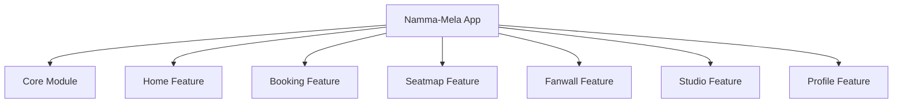

# Product Requirement Document (PRD)

## Project: Namma-Mela
**Digitizing Folk Theatre (Company Nataka) through a Premium Mobile Platform**

---

## 1. Document Control & Metadata

| Field | Description |
| :--- | :--- |
| **Document Version** | v1.0.0 |
| **Status** | Approved / Baseline |
| **Author** | Antigravity AI (Lead Product Architect) |
| **Target Audience** | Engineering Team, UX/UI Designers, Troupe Administrators, Stakeholders |
| **Last Updated** | May 11, 2026 |

---

## 2. Executive Summary

### 2.1 Product Vision
**Namma-Mela** is a premium, high-performance Android application designed to bridge the gap between traditional Indian folk theatre (specifically the rich heritage of *Company Nataka* in Karnataka) and contemporary digital ticketing and community ecosystems. 

By applying an **Apple-inspired, high-end minimalist design aesthetic** (high contrast, ample white space, deep typography, and generous rounded corners) to a historically offline and grassroots art form, Namma-Mela aims to elevate the perceived value of folk theatre, expand its reach to younger, tech-savvy demographics, and streamline operational management for theatre troupes.

---

## 3. Problem Statement & Market Opportunity

### 3.1 The Problem
Traditional Indian folk theatre holds massive cultural value and draws large seasonal crowds, yet it suffers from deep-seated operational challenges:
*   **Discovery Deficit:** Upcoming performances are mostly promoted via offline physical banners, localized loudspeakers, or word-of-mouth. There is no central digital hub for audiences to discover troupe schedules.
*   **Inconvenient Ticketing:** Tickets must be purchased in person at physical box offices, leading to long queues, uncertainty, and potential black-marketing.
*   **Community Fragmentation:** Audiences have no digital venue to share reviews, discuss performances, or connect directly with their favorite troupes.
*   **Troupe Administrative Overhead:** Troupe administrators rely on manual bookkeeping for seat bookings, roster management, and revenue analytics.

### 3.2 The Solution
Namma-Mela introduces an elegant, unified mobile aggregator that:
1.  **Centralizes discovery** through a curated Home Feed of current and upcoming productions.
2.  **Implements dynamic seat booking** with real-time feedback via a highly visual interactive seat map.
3.  **Fosters community engagement** via a digital "Fan Wall" for reviews and reactions.
4.  **Empowers administrators** through a built-in "Studio Dashboard" showing real-time occupancy graphs and cast lists.

---

## 4. User Personas

### Persona A: "The Devoted Admirer" (Traditional Audience)
*   **Demographics:** Age 45–70, resides in tier-2/tier-3 cities.
*   **Goals:** Wants to book front-row seats reliably for classical plays like *Kurukshetra* or historical mythological dramas without standing in line.
*   **Pain Points:** Finds complex, cluttered ticketing apps confusing. Needs a highly readable, intuitive, and high-contrast interface.

### Persona B: "The Cultural Explorer" (Modern Tech-Savvy Youth)
*   **Demographics:** Age 18–35, lives in urban hubs but is interested in regional heritage.
*   **Goals:** Wants to easily discover weekend plays, read reviews, browse cast members, and share comments about their experience.
*   **Pain Points:** Expects premium, modern aesthetics (similar to high-end global apps) and finds old-school regional apps visually unappealing.

### Persona C: "The Troupe Organizer" (Studio Administrator)
*   **Demographics:** Age 30–50, managing director of a folk theatre troupe.
*   **Goals:** Wants to view live analytics of sold vs. vacant seats, manage the performance schedule, and update cast profiles.
*   **Pain Points:** Relies on paper ledgers; lacks data to understand which shows are performing best or which seats sell fastest.

---

## 5. Functional Requirements & Key Modules



### 5.1 Home Module (`:feature:home`)
*   **Hero Carousel:** Displays high-priority featured shows with vibrant production posters.
*   **All Productions Grid:** Categorized grid view of all available plays.
*   **Search & Filter:** Allows users to find plays by name, location, and date.
*   **Show Status Badges:** Clearly labels shows as "Selling Fast," "Sold Out," or "Upcoming."

### 5.2 Seat Map Module (`:feature:seatmap`)
*   **Interactive Grid Layout:** A custom Compose-based grid representing rows and columns of the theatre.
*   **Visual States:**
    *   *Available:* White/Neutral outline indicating seat can be selected.
    *   *Selected:* Highly visible active highlight indicating user's current choice.
    *   *Booked:* Solid grey/inactive state indicating the seat is already taken.
*   **Dynamic Total Calculator:** Bottom panel that updates ticket count and price in real-time as seats are selected/deselected.

### 5.3 Booking Module (`:feature:booking`)
*   **Ticket Confirmation Summary:** Details show name, date, time, selected seats, and final price breakdown.
*   **Digital Ticket Generator:** Generates a secure mock ticket with a visual ticket stub and digital code.
*   **Local DB Persistence:** Saves successful bookings immediately to the device's Room database.

### 5.4 Fan Wall Module (`:feature:fanwall`)
*   **Interactive Review Feed:** A social timeline where users view reviews left by other community members.
*   **Review Submission:** Form allowing users to rate performances and write text reviews.
*   **Applause System:** High-interaction visual button allowing users to "Applaud" (like) helpful reviews, accompanied by custom micro-animations.

### 5.5 Studio Dashboard Module (`:feature:studio`)
*   **Live Occupancy Chart:** Interactive visual representation (e.g., Donut Chart) displaying current ticket sales analytics (Occupied vs. Vacant).
*   **Troupe Roster Manager:** Displays and manages list of cast members, their roles, and bios.
*   **Production Controls:** Interface allowing administrators to upload promotional banners and adjust show timings.

---

## 6. Technical Architecture & System Specifications

### 6.1 Multi-Module Android System
The application is structured in accordance with **Clean Architecture** and **MVVM** design principles, split into multiple Gradle modules:

| Module Path | Responsibility | Dependencies |
| :--- | :--- | :--- |
| `:app` | Entry point, Application class, Hilt Component, main navigation setup. | All `:feature` modules, `:core` |
| `:core` | Design System (Colors, Theme, Typography), Local DB (Room), DI Modules, Shared Repositories. | None (Standalone) |
| `:feature:home` | Discover feed, featured shows list. | `:core` |
| `:feature:booking`| Checkout summary, local booking creation. | `:core` |
| `:feature:seatmap`| Interactive seat selection grid. | `:core` |
| `:feature:fanwall`| Review timeline and applause logic. | `:core` |
| `:feature:studio` | Admin analytics, troupe management dashboard. | `:core` |
| `:feature:profile`| User profile information and booking history. | `:core` |

### 6.2 Data Schema (Room Persistence)
```kotlin
@Entity(tableName = "bookings")
data class BookingEntity(
    @PrimaryKey(autoGenerate = true) val id: Int = 0,
    val showTitle: String,
    val date: String,
    val time: String,
    val seats: String, // Comma-separated list (e.g., "A3, A4")
    val totalPrice: Double,
    val ticketCode: String
)
```

---

## 7. UX & Visual Design Requirements

### 7.1 "Apple-Inspired" Minimalist Aesthetic
To create a high-end, premium feel, the user interface must adhere strictly to the following parameters:
*   **Color Palette:**
    *   *Primary background:* Pure white (`#FFFFFF`) or ultra-light grey (`#F8F9FA`).
    *   *Primary text:* Charcoal black (`#1A1A1A`) to ensure deep contrast.
    *   *Accents:* Curated, smooth gradients or subtle organic tones instead of raw/generic primary colors.
*   **Typography:** Strict use of the **Inter** font family via Google Fonts, emphasizing clean sans-serif weights for high readability.
*   **Layout:**
    *   *Rounded corners:* Extensive use of smooth, large corner radii (typically `24.dp` or `16.dp` for cards and buttons).
    *   *Whitespace:* Generous padding and margins to let content "breathe" and highlight the rich production artwork.

---

## 8. Non-Functional Requirements (NFR)

1.  **Offline-First Resilience:** Core application data and booking history must remain accessible even in remote areas with poor internet connectivity using the local Room DB.
2.  **Performance & Rendering:** UI components must render at a consistent 60fps (or 120fps on compatible displays). Jetpack Compose re-compositions must be highly optimized with stable data models.
3.  **Low Battery & Data Footprint:** Optimize network payloads and database read/writes to minimize resource usage on mid-range and legacy devices.
4.  **Localization:** Full dual-language support for **Kannada** and **English** to respect regional authenticity and broaden accessibility.

---

## 9. Future Roadmap & Scale

*   **Phase 1 (Active):** Multi-module structure, Jetpack Compose UI, Room DB local synchronization, Firebase Base Analytics, and local mock-state execution.
*   **Phase 2:** Real-time seat locking using Firebase Realtime Database to prevent concurrent booking conflicts.
*   **Phase 3:** Integration of standard regional payment gateways (Razorpay, PhonePe SDK, or UPI Intent) inside `:feature:booking`.
*   **Phase 4:** Cloud-based troupe notifications and automatic push notifications to alert fans of new play announcements nearby.
